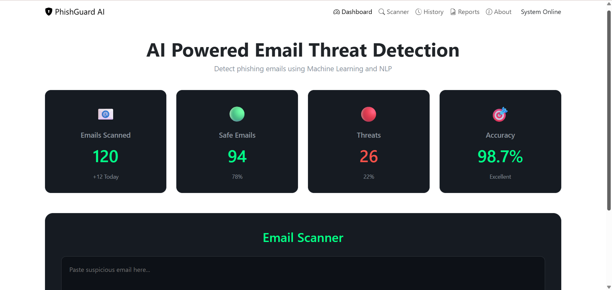

# 🛡️ PhishGuard AI – Phishing Email Detection System

PhishGuard AI is a Machine Learning-based web application that detects whether an email is **Phishing** or **Safe**.  
Built with **Flask and Scikit-learn**, it simulates a real-world **cybersecurity (SOC) tool** used to analyse suspicious emails.

---

## 🚀 Features

- 🔍 Detect phishing emails using NLP & ML  
- 📊 Dashboard with email statistics  
- ⚠️ Risk Score & Severity classification  
- 🧠 Threat keyword detection  
- 🌐 Clean and interactive web interface  

---

## 🛠️ Tech Stack

- **Frontend:** HTML, CSS  
- **Backend:** Flask (Python)  
- **Machine Learning:** Scikit-learn (TF-IDF)  
- **Libraries:** pandas, numpy, pickle  

---

## ⚙️ How It Works

1. User enters email content  
2. Text is transformed using **TF-IDF Vectorizer**  
3. ML model predicts:
   - Phishing ⚠️  
   - Safe ✅  
4. Risk score is calculated  
5. Threat indicators are identified  
6. Results are displayed on the dashboard  

---

## 🧪 Example Output

### 📊 Dashboard


```text
Emails Scanned: 120 (+12 Today)
Safe Emails: 94 (78%)
Threats: 26 (22%)
Accuracy: 98.7% (Excellent)

🔍 Email Scanner

Action:
- Paste suspicious email
- Click "Scan Email"

System:
- Processes text
- Runs ML model
- Displays result

⚠️ Phishing Detection

🚨 Phishing Email Detected

Risk Score: 15
Severity: LOW

Threat Indicators:
- click here detected

✅ Safe Email Detection

✅ Safe Email Detected

Risk Score: 75
Severity: HIGH

Threat Indicators:
- urgent detected
- verify detected
- login detected
- bank detected

📊 Model Details
Algorithm: Naive Bayes / Logistic Regression
Feature Extraction: TF-IDF
Accuracy: ~98%
📌 Future Improvements
🌍 URL reputation analysis
📧 Email header inspection
📊 Advanced SOC dashboard
🤖 Deep learning model integration
📢 Disclaimer

This project is for educational purposes only and demonstrates a basic phishing detection system.
It can be extended into a full-scale cybersecurity monitoring tool.
